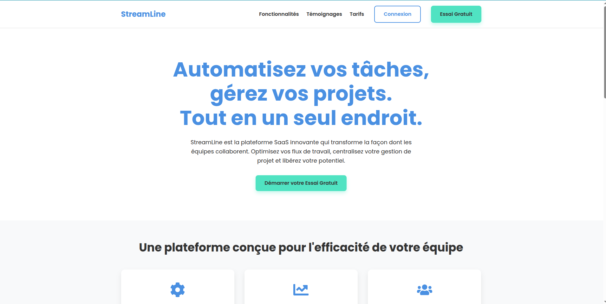

# StreamLine - Landing Page en React



## Description du Projet
Ce projet est une landing page moderne et réactive développée pour StreamLine, une plateforme SaaS fictive qui aide les équipes à automatiser leurs flux de travail et à gérer leurs projets de manière centralisée. L'objectif est de présenter l'entreprise, ses fonctionnalités clés, les témoignages clients, les plans tarifaires et un appel à l'action final de manière attrayante et professionnelle.

Le design est épuré, avec une palette de couleurs et une typographie spécifiques pour refléter l'identité de marque de StreamLine.

## Architecture
Le projet est construit avec React.js et Vite, suivant une architecture basée sur les composants pour une meilleure modularité et maintenabilité, conformément aux principes du "Clean Code".

Voici la structure des dossiers et la responsabilité de chaque fichier/dossier :

```
streamline-landing-page/
├── public/                          # Fichiers statiques (ex: favicon, robots.txt)
│   └── ...                          
├── src/                             # Code source principal
│   ├── assets/                      # Images, icônes, SVG personnalisés
│   ├── components/                  # Composants React de la landing page
│   │   ├── Header.jsx              # En-tête avec logo, navigation et menu mobile
│   │   ├── Hero.jsx                # Section d’intro avec titre, description et CTA
│   │   ├── Features.jsx            # Fonctionnalités principales de StreamLine
│   │   ├── Testimonials.jsx        # Avis et témoignages clients
│   │   ├── Pricing.jsx             # Offres et plans tarifaires
│   │   ├── FinalCTA.jsx            # Dernier appel à l’action
│   │   ├── Footer.jsx              # Pied de page (liens, copyright, réseaux)
│   │   └── ScrollToTopButton.jsx   # Bouton de retour en haut de page
│   ├── App.jsx                      # Composant racine : assemble toute la page
│   ├── index.css                    # Styles globaux et utilitaires
│   └── main.jsx                     # Point d’entrée de l’app (rendu dans le DOM)
├── .gitignore                       # Fichiers à ignorer par Git
├── index.html                       # HTML principal injecté par React
├── package.json                     # Dépendances, scripts, métadonnées npm
├── vite.config.js                   # Configuration de l’outil Vite
└── README.md                        # Documentation du projet
```

### Principes "Clean Code" Appliqués :
* **Modularité des Composants :** Chaque section de la page est un composant React indépendant, favorisant la réutilisabilité et la clarté.
* **Responsabilité Unique :** Chaque composant est conçu pour avoir une seule responsabilité bien définie.
* **Noms Clairs et Explicites :** Les variables, fonctions et classes CSS ont des noms qui décrivent clairement leur rôle.
* **Commentaires :** Des commentaires sont ajoutés dans le code (JSX et CSS) pour expliquer la logique complexe ou les choix architecturaux.

## Technologies Utilisées
* **React.js (v18.x)** : Bibliothèque JavaScript pour construire des interfaces utilisateur.
* **Vite (v5.x)** : Outil de build rapide pour le développement front-end moderne.
* **JavaScript (ES6+)** : Langage de programmation principal.
* **CSS3** : Pour le stylisme de l'application, utilisant Flexbox et Grid pour des mises en page réactives.
* **React Icons (v5.x)** : Bibliothèque d'icônes populaires pour React.
* **Google Fonts ('Poppins')** : Pour la typographie de l'application.

## Palette de Couleurs
* **Bleu principal :** `#4A90E2`
* **Vert pour CTAs :** `#50E3C2`
* **Gris foncé (texte) :** `#333333`
* **Gris clair (sous-titres) :** `#AAAAAA`
* **Fonds :** `#FFFFFF` et `#F8F9FA`

## Comment lancer le projet

Pour lancer ce projet sur votre machine locale, suivez les étapes ci-dessous :

1.  **Cloner le dépôt GitHub (si hébergé) ou créer le dossier du projet :**
    Si vous avez cloné le projet, naviguez dans son répertoire :
    ```bash
    cd streamline-landing-page
    ```
    Si vous partez de zéro (comme nous l'avons fait) :
    ```bash
    npm create vite@latest streamline-landing-page -- --template react
    cd streamline-landing-page
    ```

2.  **Installer les dépendances :**
    Dans le répertoire du projet, exécutez la commande suivante pour installer toutes les dépendances listées dans `package.json` :
    ```bash
    npm install
    ```

3.  **Lancer le serveur de développement :**
    Une fois les dépendances installées, vous pouvez démarrer le serveur de développement. L'application sera disponible dans votre navigateur à l'adresse indiquée (généralement `http://localhost:5173/`).
    ```bash
    npm run dev
    ```

4.  **Construire le projet pour la production (facultatif) :**
    Pour générer une version optimisée du projet prête pour le déploiement, utilisez la commande :
    ```bash
    npm run build
    ```
    Les fichiers de production seront générés dans le dossier `dist/`.

---